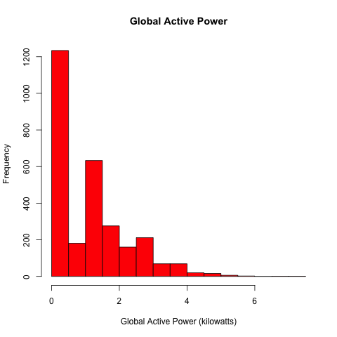
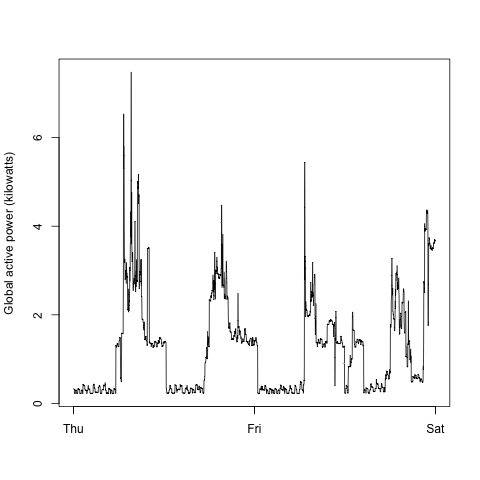
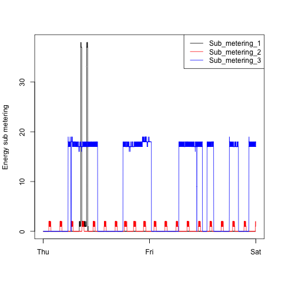
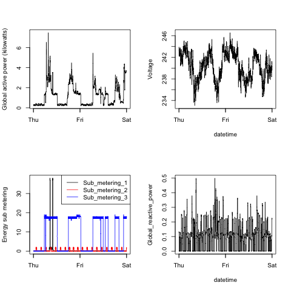

## Introduction

This readme file has been changed since its original version, so it easier for a reviewer to understand the implementation.

Please review below how data has been loaded. Then each plot contains source code, generated plot and original plot for the reference.

## Loading the data

In order to make loading data faster, we have used `fread` function, because it is very efficient. `fread` has a nice feature that we can embed grep function, so we read only dates 1/2/2007 and 2/2/2007. Unfortunately, that requires us to provide exact column names.
```r
epc <- fread(input = "grep '^[1-2]/2/2007' household_power_consumption.txt",
          col.names = c("Date", "Time", "Global_active_power", 
                        "Global_reactive_power", "Voltage",
                        "Global_intensity", "Sub_metering_1",
                        "Sub_metering_2", "Sub_metering_3"),
          na.strings = "?")
```
Also, we need to create a separate column for timestamp. `lubridate` provides functions for easy parsing of the data and time.
```r
epc <- epc %>% mutate(Timestamp = dmy_hms(paste(Date, Time, sep = " ")))
```

## Making Plots

Please review the embedded plots below. There are both original and generated plots. They should be similar. Keep in mind that `plot.tofile` writes to a file, when `plot1`, `plot2`, etc. write to the default device.

### Plot 1

```r
plot.plot1 <- function(epc) {
    with(epc, hist(Global_active_power, xlab = "Global Active Power (kilowatts)",
                   ylab = "Frequency",
                   main = "Global Active Power",
                   col = "red"))
    
}
```
Generated:
 


Original for the reference:
 


### Plot 2
```r
plot.plot2 <- function(epc) {
    with(epc, plot(Timestamp, Global_active_power, type = "n",
                   xlab = "", ylab = "Global active power (kilowatts)"))
    with(epc, lines(Timestamp, Global_active_power))
}
```

Generated:
 

Original for the reference:
 


### Plot 3
```r
plot.plot3 <- function(epc) {
    with(epc, plot(Timestamp, Sub_metering_1, type = "n",
                   xlab = "", ylab = "Energy sub metering"))
    with(epc, lines(Timestamp, Sub_metering_1, col = "black"))
    with(epc, lines(Timestamp, Sub_metering_2, col = "red"))
    with(epc, lines(Timestamp, Sub_metering_3, col = "blue"))
    legend("topright", 
           legend = c("Sub_metering_1", "Sub_metering_2", "Sub_metering_3"),
           col = c("black", "red", "blue"),
           lty = 1)
}
```

Generated:
 

Original for the reference:
 


### Plot 4
Plot 4 reuses previous written functions as well as add to them.
```r
plot.plot4 <- function(epc) {
    par(mfrow=c(2,2))
    plot.plot1(epc)
    
    with(epc, plot(Timestamp, Voltage, xlab = "datetime", type = "n"))
    with(epc, lines(Timestamp, Voltage))
    
    plot.plot3(epc)
    
    with(epc, plot(Timestamp, Global_reactive_power, xlab = "datetime", type = "n"))
    with(epc, lines(Timestamp, Global_reactive_power))
}
```
Generated:
 

Original for the reference:
 

### Generating PNG files
Generating PNG files is straightforward.

```r
plot.tofile <- function(epc) {
    png("plots/plot1.PNG")
    plot.plot1(epc)
    dev.off()
    
    png("plots/plot2.PNG")
    plot.plot2(epc)
    dev.off()
    
    png("plots/plot3.PNG")
    plot.plot3(epc)
    dev.off()
    
    png("plots/plot4.PNG")
    plot.plot4(epc)
    dev.off()
}
```
